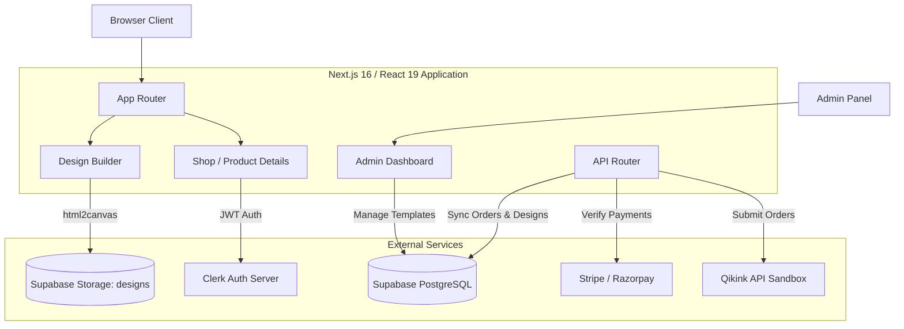
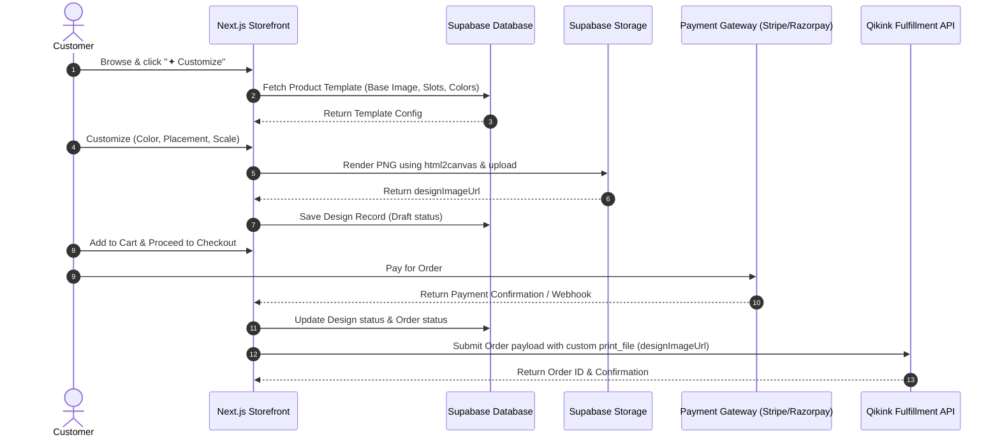

# ✦ Unwearable ✦

> **Brutalist-designed, premium customizable e-commerce platform.** Built with Next.js 16 (Turbopack), Supabase, Clerk, and Qikink print-on-demand fulfillment.

---

## 🚀 Overview

**Unwearable** is a next-generation streetwear e-commerce platform that combines a high-contrast **Brutalist UI** aesthetic with a state-of-the-art **Design Builder** for apparel customization. 

The application integrates:
- **Supabase** for database persistence, storage, and secure Row-Level Security (RLS) policies.
- **Clerk** for seamless user authentication (email-only).
- **Stripe & Razorpay** for secure, globally-capable payment processing.
- **Qikink Sandbox API** for automated print-on-demand fulfillment.

---

## 🏗️ System Architecture



---

## 🔄 Core User Flow & Order Lifecycle



---

## ✨ Key Features

1. **Brutalist UI Design Language**
   - High-contrast, Neo-Brutalist styling characterized by thick borders (`border-brutal`), hard black shadows (`box-shadow`), neo-retro typography, and custom micro-animations.
   - Built using raw CSS/PostCSS utilities.
2. **Interactive 4-Step Design Builder** (`/customize/[templateId]`)
   - **Step 1: Select Template** -> **Step 2: Pick Color** -> **Step 3: Choose Placement** -> **Step 4: Confirm**.
   - CSS-layered positioning allows a real-time preview of user graphics overlaid on mockups.
   - Converts the client-side DOM container into a clean transparent PNG via `html2canvas`, storing it securely in Supabase Storage.
3. **Automated Print-on-Demand Fulfillment**
   - Integrated with **Qikink REST API** endpoints for automated order creation.
   - Direct injection of the customized print file URL (`designImageUrl`) into the Qikink order payload.
   - Robust fallback mechanisms to local SKUs if Supabase products fail to fetch.
4. **Secure Admin Dashboard** (`/admin`)
   - **Product Manager**: CRUD operations for products, mapping slug identifiers to physical Qikink SKUs.
   - **Template Manager** (`/admin/templates`): Add base templates, define placement slots (JSON coordinates), and set permitted color palettes.
   - Access control restricted to authorized administrator emails (secured server-side by Clerk auth + environment filter).
5. **Robust State & Query Hooks**
   - Implements structured feedback loops with unified components for handling empty, loading, and error states.
   - Generic client-side hook `useSupabaseQuery` wraps all async Supabase operations with full loading, error, and refetch lifecycles.

---

## 🛠️ Technology Stack

| Layer | Technology | Description |
|---|---|---|
| **Core Framework** | Next.js 16.2.2 (App Router) | Utilizing React 19 Server & Client Components |
| **Compiler** | Turbopack | High-speed local build and hot-reloading tool |
| **Authentication** | Clerk Server SDK (`@clerk/nextjs`) | Secured routes via middleware and email magic links |
| **Database** | Supabase PostgreSQL | Secure relational tables mapped via Row-Level Security (RLS) |
| **File Storage** | Supabase Storage | Public bucket `designs` for hosting high-res mockups |
| **Styling** | PostCSS + Tailwind CSS v4 | Custom brutalist design tokens and theme extensions |
| **Integrations** | Qikink, Stripe, Razorpay | Fulfillment and payment pipelines |

---

## 📁 Repository Structure

```
.
├── src/
│   ├── app/                        # Next.js App Router Segments
│   │   ├── account/                # User settings and personal order history
│   │   ├── admin/                  # Admin panel dashboards & template manager
│   │   ├── api/                    # Server-side API endpoints
│   │   │   ├── orders/             # Order creation & Qikink integration
│   │   │   └── payment/            # Checkout, verification & webhook handlers
│   │   ├── cart/                   # Shopper cart page (client-side state)
│   │   ├── checkout/               # Stripe/Razorpay Checkout page
│   │   ├── customize/              # Design Builder entry component
│   │   ├── product/                # Product details with dynamic customizer links
│   │   ├── shop/                   # Catalog listing
│   │   └── layout.tsx              # Root page wrapper with providers (Clerk, Context)
│   ├── components/                 # React UI Component Library
│   │   ├── admin/                  # Forms and lists for templates/products
│   │   ├── builder/                # Wizard steps, custom canvas preview & positioning
│   │   ├── ui/                     # Reusable design tokens (BrutalButton, BrutalInput)
│   │   └── account/                # Order lists, order details, loading wrappers
│   ├── context/                    # React Contexts for global state
│   │   ├── CartContext.tsx         # Add, remove, update quantities, persist storage
│   │   └── DesignContext.tsx       # Wizard step sequencer & design metadata
│   ├── lib/                        # Client & Server integrations
│   │   ├── designApi.ts            # Supabase operations (CRUD for templates/designs)
│   │   └── supabaseHooks.ts        # Custom `useSupabaseQuery` hook
│   ├── types/                      # Comprehensive TypeScript definitions
│   └── server/                     # Core Business logic/Service Layer files
└── SQL Schemas/                    # Schema migrations for production databases
```

---

## 🗄️ Database Schemas & Row-Level Security (RLS)

### `templates` Table
Stores product configuration settings.

```sql
CREATE TABLE public.templates (
    id UUID DEFAULT gen_random_uuid() PRIMARY KEY,
    product_id TEXT NOT NULL,           -- Matches product slug
    name TEXT NOT NULL,
    base_image_url TEXT NOT NULL,
    placements JSONB NOT NULL DEFAULT '[]'::jsonb,
    colors JSONB NOT NULL DEFAULT '[]'::jsonb,
    is_active BOOLEAN DEFAULT TRUE,
    created_at TIMESTAMP WITH TIME ZONE DEFAULT timezone('utc', now()) NOT NULL
);
```

### `designs` Table
Tracks user-generated design mockups.

```sql
CREATE TABLE public.designs (
    id UUID DEFAULT gen_random_uuid() PRIMARY KEY,
    user_id TEXT NOT NULL,               -- Clerk User ID
    template_id UUID REFERENCES public.templates(id) ON DELETE CASCADE,
    product_slug TEXT NOT NULL,
    selected_color JSONB NOT NULL,
    selected_placement JSONB NOT NULL,
    design_config JSONB NOT NULL,
    preview_image_url TEXT,
    status TEXT DEFAULT 'draft',
    created_at TIMESTAMP WITH TIME ZONE DEFAULT timezone('utc', now()) NOT NULL
);
```

### Row-Level Security (RLS) Configuration

1. **Templates Access**:
   - Anyone (anonymous/authenticated) can **Read** templates to display customization choices.
   - Only authorized admins can **Insert**, **Update**, or **Delete** templates.
2. **Designs Access**:
   - Users can only **Read**, **Update**, or **Delete** designs where `user_id` matches their authenticated Clerk User ID.
   - **Insert** is enabled for all authenticated users creating a new design draft.

---

## 🧱 Design System State Components

To standardize states across user accounts, the project provides reusable components in `src/components/account/state/`:

*   **`ErrorState`**: Standardized error page with custom message, error trace display, and action buttons.
*   **`LoadingState`**: Center-aligned loading spinners with custom message prompts.
*   **`EmptyState`**: Standard placeholder illustrations for empty carts, profiles, or transaction tables.

#### Custom Supabase Query Hook (`useSupabaseQuery`)
```typescript
import { useSupabaseQuery } from '@/lib/supabaseHooks';

const { data, error, loading, refetch } = useSupabaseQuery(
  () => supabase.from('orders').select('*')
);
```

---

## 🔧 Environment Configuration

Create a `.env.local` file in the root directory:

```env
# Supabase Configuration
NEXT_PUBLIC_SUPABASE_URL=https://your-project.supabase.co
NEXT_PUBLIC_SUPABASE_ANON_KEY=your-anon-key
SUPABASE_SERVICE_ROLE_KEY=your-service-role-key

# Clerk Authentication Keys
NEXT_PUBLIC_CLERK_PUBLISHABLE_KEY=pk_test_...
CLERK_SECRET_KEY=sk_test_...

# Qikink Integration Settings
QIKINK_API_URL=https://sandbox.qikink.com/api
QIKINK_CLIENT_ID=your-client-id
QIKINK_CLIENT_SECRET=your-client-secret

# Administrator Config
ADMIN_EMAIL=varungupta010307@gmail.com
```

---

## 🚀 Getting Started

### Local Setup
1. **Clone & Install**:
   ```bash
   npm install
   ```
2. **Database Migrations**:
   Run the schema definitions (`supabase_schema.sql`, `production_schema.sql`) inside your Supabase SQL editor. Create a storage bucket named `designs` set to **Public**.
3. **Execute Developer Server**:
   ```bash
   npm run dev
   ```

### Vercel Deployment
The repository is fully optimized for Vercel:
- **Build Command**: `next build`
- **Output Directory**: `.next`
- Make sure to define all environment variables in **Vercel Settings -> Environment Variables**.
- Set up **CORS** configurations in Supabase Storage to allow requests from your deployment domain.

---

## 📄 License
Licensed under the [MIT License](LICENSE).
