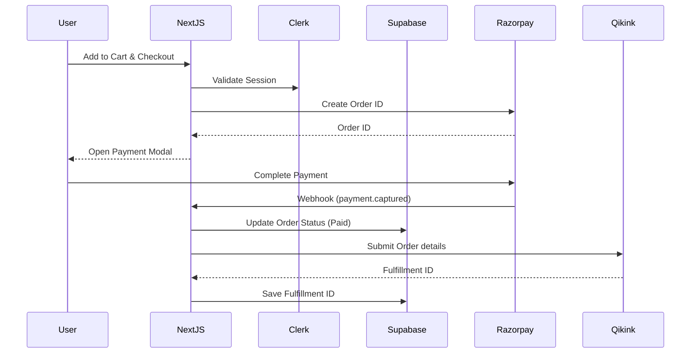

# Architecture Overview

Unwearable is built using a modern, serverless architecture that leverages the Next.js App Router for both frontend rendering and backend API routes. The system is designed to be highly scalable, secure, and maintainable.

## High-Level Architecture

The platform operates as a monolithic Next.js application deployed on Vercel, integrating with several best-in-class third-party services:

1. **Frontend**: Next.js App Router, React, Tailwind CSS.
2. **Backend/API**: Next.js Serverless Functions (Route Handlers).
3. **Authentication**: Clerk.
4. **Database**: Supabase (PostgreSQL).
5. **Payments**: Razorpay.
6. **Fulfillment**: Qikink Dropshipping API.

## System Components

### 1. The Frontend (Client Layer)
The user interface is built using React Server Components (RSC) and Client Components where interactivity is required. 
- **Styling**: Tailwind CSS is used for utility-first, responsive design.
- **State Management**: React Context is used for global state (e.g., the Cart context and the Design Builder context).
- **Data Fetching**: A mix of server-side data fetching (direct database access) and client-side fetching via internal API routes.

### 2. Authentication & Authorization (Clerk)
Clerk handles all user authentication.
- **Middleware**: Next.js Middleware (`src/proxy.ts`) intercepts all requests. It verifies the Clerk session token and blocks unauthorized access to protected routes (like `/account` or `/admin`).
- **Webhooks**: Public API routes (like Razorpay webhooks) explicitly bypass this middleware.

### 3. Database Layer (Supabase)
Supabase provides a managed PostgreSQL database.
- **Security**: Row Level Security (RLS) ensures that users can only read/write their own data (e.g., viewing their own orders).
- **Service Role**: For internal serverless tasks (like updating order status post-payment), the backend uses a `service_role` key to securely bypass RLS.

### 4. Payment Processing (Razorpay)
The checkout flow uses Razorpay for secure payments.
1. **Order Creation**: The backend creates a Razorpay Order ID.
2. **Client Checkout**: The frontend loads the Razorpay SDK and opens the payment modal.
3. **Webhook Verification**: Upon successful payment, Razorpay sends a webhook to the backend. The backend verifies the HMAC signature using the webhook secret to prevent spoofing.

### 5. Fulfillment Integration (Qikink)
Once a payment is verified, the system automatically routes the order to Qikink for fulfillment.
- **Internal API**: The webhook triggers an internal API route (`/api/orders/submit`) secured by an `INTERNAL_API_KEY`.
- **Background Execution**: Due to Vercel's serverless constraints, the order submission is explicitly awaited in the background using `waitUntil()` to prevent execution freezing before the Qikink API responds.

## Data Flow Diagram

